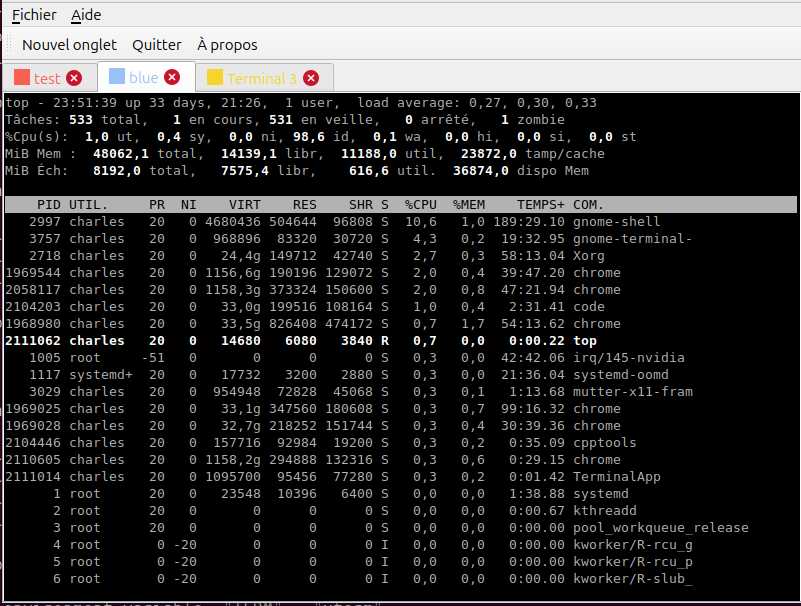
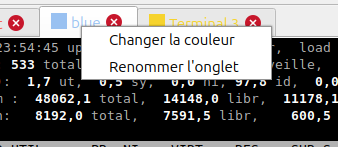
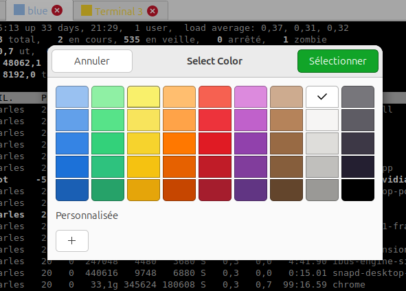
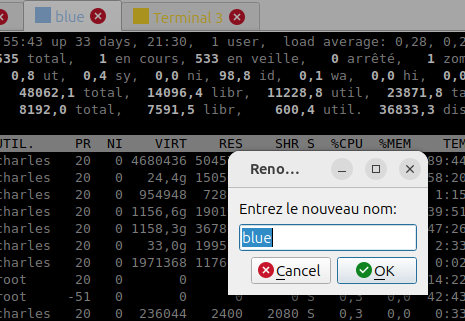

# TerminalApp
terminal with tabwidget in QT + color for tab and save configuration.
Make a try with the help of Grok. 

* When you close the app , then it's save all terminal open color , and path where you are in the file terminal_config.json 
* When you open it again then it reads the terminal_config.json and you have the save configuration !

You should clone qtterminalwidget to compil the projet! 
Depends of ... 

https://github.com/jacob3141/qtterminalwidget

# Screenhot 

